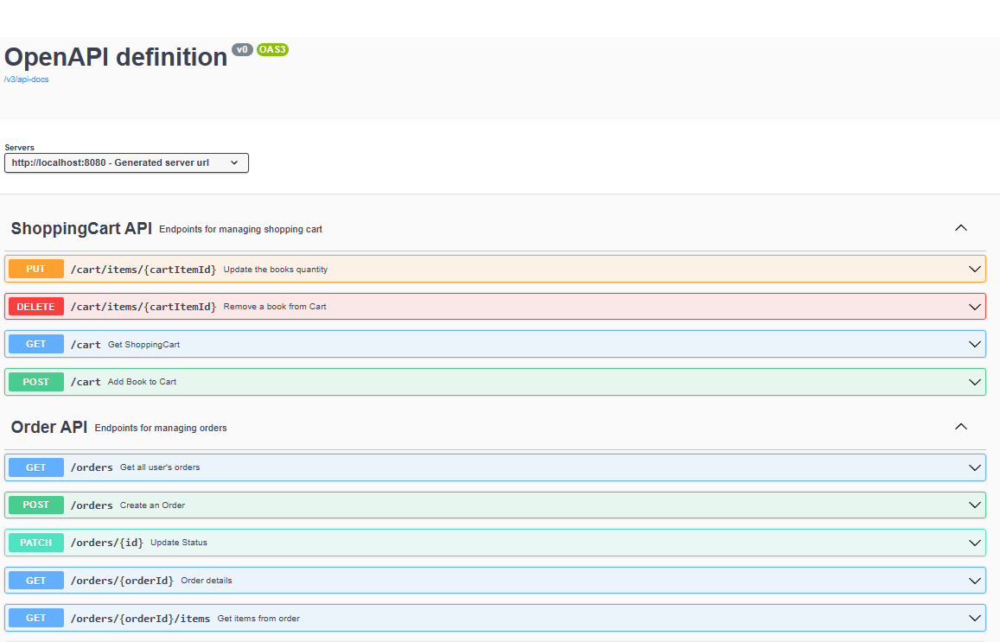
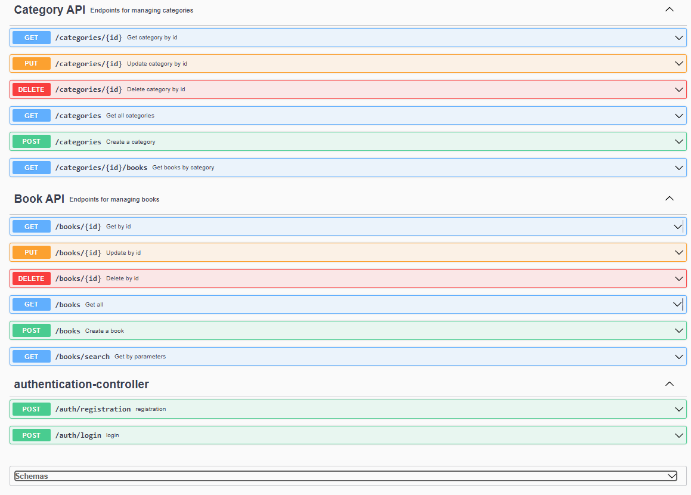
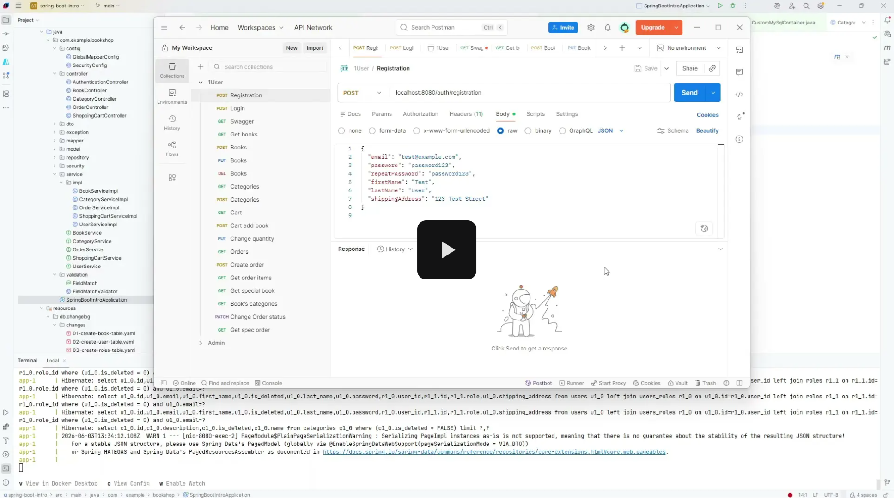

# Spring Boot Book Shop API

REST API for an online bookstore built with Spring Boot.

The project demonstrates modern backend development practices, including JWT authentication, role-based access control, database migrations with Liquibase, Dockerized deployment, and API documentation with Swagger/OpenAPI.

## Features

### Authentication

* User registration
* User login
* JWT-based authentication
* Role-based authorization

### Books

* View all books
* View book details
* Search books using filters
* Create books (Admin only)
* Update books (Admin only)
* Delete books (Admin only)

### Categories

* View categories
* View books by category
* Create categories (Admin only)
* Update categories (Admin only)
* Delete categories (Admin only)

### Shopping Cart

* Add books to cart
* Update cart item quantity
* Remove books from cart
* View current shopping cart

### Orders

* Create orders
* View order history
* View order details
* View order items
* Update order status (Admin only)

---

## Technology Stack

* Java 17
* Spring Boot
* Spring Security
* JWT Authentication
* Spring Data JPA
* Hibernate
* MySQL
* Liquibase
* MapStruct
* Maven
* Docker & Docker Compose
* Swagger / OpenAPI

---

## Architecture

The application follows a layered architecture:

```text
src
├── controller
├── service
├── repository
├── model
├── dto
├── mapper
├── security
├── config
└── db
    └── changelog
```

---
## Getting Started

### 1. Clone the Repository

```bash
git clone https://github.com/BelitskyiAlexandr/spring-boot-intro.git
cd spring-boot-intro
```

### 2. Configure Environment Variables

Create a `.env` file in the project root directory.

Example `.env` file:

```env
MYSQL_ROOT_PASSWORD=bookshop_root_password
MYSQL_DATABASE=bookshop_db
MYSQL_USER=bookshop_user
MYSQL_PASSWORD=bookshop_password

MYSQL_LOCAL_PORT=3306
MYSQL_DOCKER_PORT=3306

SPRING_LOCAL_PORT=8080
SPRING_DOCKER_PORT=8080

DEBUG_PORT=5005
```

These variables are used by `docker-compose.yml` to configure MySQL, application ports, and remote debugging.

For local development without Docker, database connection settings can also be configured in:

```text
src/main/resources/application.properties
```

---

## Running the Application

### Docker

Build and start the application:

```bash
docker compose up --build
```

Recreate the database:

```bash
docker compose down -v
docker compose up --build
```

### Local Development

Build the project:

```bash
mvn clean package
```

Run the application:

```bash
mvn spring-boot:run
```

---

## API Documentation

Swagger UI:

```text
http://localhost:8080/swagger-ui/index.html
```

---

## Swagger Screenshots

### Shopping Cart and Orders



### Categories, Books, and Authentication




---

## Demo

[](https://drive.google.com/file/d/1wGIBgV_PDFcL6iGDChRU6qE9B8IzoCkI/view?usp=sharing)

Click the image above to watch the full demonstration.

---

## User Roles

### USER

Permissions:

* Browse books and categories
* Manage shopping cart
* Create orders
* View own orders

### ADMIN

Permissions:

* Manage books
* Manage categories
* View all orders
* Update order statuses

---

## Default Demo Administrator

```json
{
  "email": "admin123@test.com",
  "password": "admin123"
}
```

---

## Example API Endpoints

### Authentication

```http
POST /auth/registration
POST /auth/login
```

### Books

```http
GET    /books
GET    /books/{id}
GET    /books/search

POST   /books
PUT    /books/{id}
DELETE /books/{id}
```

### Categories

```http
GET    /categories
GET    /categories/{id}
GET    /categories/{id}/books

POST   /categories
PUT    /categories/{id}
DELETE /categories/{id}
```

### Shopping Cart

```http
GET    /cart
POST   /cart
PUT    /cart/items/{cartItemId}
DELETE /cart/items/{cartItemId}
```

### Orders

```http
GET    /orders
GET    /orders/{orderId}
GET    /orders/{orderId}/items
GET    /orders/{orderId}/items/{itemId}

POST   /orders
PATCH  /orders/{id}
```

---

## License

This project was created for educational purposes as part of learning and practicing Spring Boot development.
